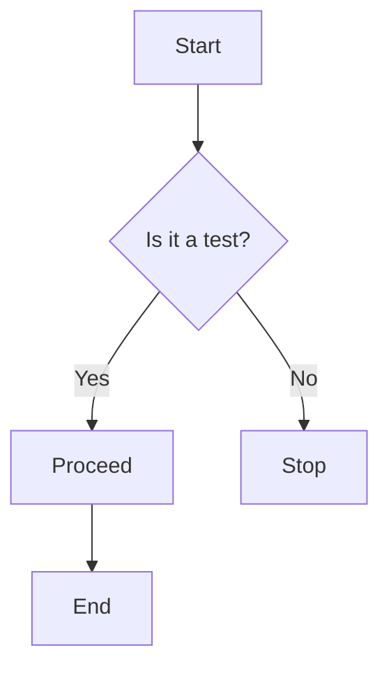
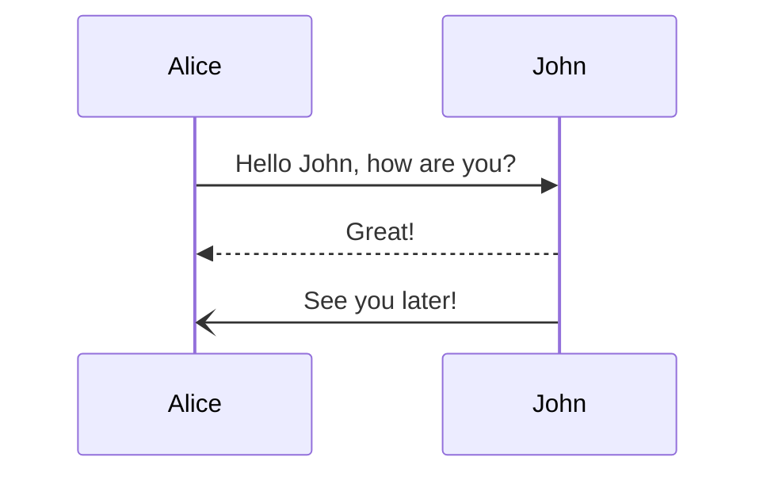

# Full Markdown Stress Test

This document is designed to test **every** major Markdown feature. It's a comprehensive reference and compatibility test.

---

## 1. Headings (All Levels)

# Media nesting test

Here the audio should be playable:


## Video


### Heading 3
#### Heading 4
##### Heading 5
###### Heading 6

---

## 2. Text Formatting (Emphasis & Style)

- **Bold text** (or __bold__)
- *Italic text* (or _italic_)
- ***Bold and Italic*** (or ___bold and italic___)
- ~~Strikethrough~~
- `Inline code`
- <u>Underline (HTML tag)</u>
- <mark>Highlighted text</mark> (HTML tag)
- H~2~O (Subscript, using <sub>)
- X^2^ (Superscript, using <sup>)

---

## 3. Blockquotes

> This is a standard blockquote.
> It can span multiple lines.

> **Nested blockquotes:**
> > This is a quote inside a quote.
> > > And a third level.

> **Blockquotes with other elements:**
>
> - List item 1
> - List item 2
>
> `Code snippet` inside a blockquote.

---

## 4. Lists

### Unordered List (Bullets)

- Item 1
- Item 2
  - Sub-item 2.1
    - Sub-item 2.1.1
  - Sub-item 2.2
- Item 3

### Ordered List (Numbers)

1. First item
2. Second item
   1. Sub-item 2.1
   2. Sub-item 2.2
3. Third item

### Task Lists (Checkboxes)

- [x] Completed task
- [ ] Incomplete task
- [ ] Another task
  - [x] Nested completed task
  - [ ] Nested incomplete task

### Mixed Lists

- **Important:** This is a bold item.
- *Important:* This is an italic item.
- `code` item.
1. Numbered item with a paragraph.
   
   This paragraph is indented and part of the numbered item.
   
   - Bullet sub-list inside a numbered item.
   - Another bullet.

---

## 5. Code Blocks

### Inline Code
Use `<p>` for paragraphs in HTML.

### Fenced Code Block (with language)
```python
def hello_world():
    """A simple function."""
    print("Hello, Markdown!")
    return True
```

### Fenced Code Block (without language)
```
This is a generic code block.
It preserves spacing and line breaks.
   Indented lines are kept.
```

### Indented Code Block (4 spaces)

    def main():
        print("This is indented with 4 spaces.")

### Diff / Highlighting
```diff
- This line is removed
+ This line is added
! This line is highlighted as a warning
# This line is commented
```

---

## 6. Tables

### Basic Table

| Header 1 | Header 2 | Header 3 |
|----------|----------|----------|
| Row 1    | Data     | Data     |
| Row 2    | Data     | Data     |
| Row 3    | Data     | Data     |

### Table with Alignment

| Left Aligned | Center Aligned | Right Aligned |
|:-------------|:--------------:|--------------:|
| Left         | Center         | Right         |
| Data         | Data           | Data          |
| Longer Text  | Longer Text    | Longer Text   |

### Table with Inline Formatting

| Feature         | Description                                |
|-----------------|--------------------------------------------|
| **Bold**        | `**text**`                                 |
| *Italic*        | `*text*`                                   |
| `Code`          | Inline `code`                              |
| [Link](#)       | A hyperlink                                |
| Row span?       | Not natively supported, but can use HTML. |

---

## 7. Links and URLs

### Standard Link
[Visit GitHub](https://github.com)

### Link with Title (Tooltip)
[Google](https://google.com "Search Engine")

### Bare URLs (Auto-link)
https://www.example.com

### Email Auto-link
<user@example.com>

### Reference Links
[Reference-style link][ref1]

[ref1]: https://example.com "Reference Link Title"

### Relative Link
[Go to Section 9](#9-horizontal-rules)

---

## 8. Images

### Standard Image


### Reference Image
![Alt text][img-ref]

[img-ref]: /image/2016romestreets.jpg  "Reference Image"

---

## 9. Horizontal Rules

Rule 1 (---):

---

Rule 2 (***):

***

Rule 3 (___):

___

---

## 10. HTML (Inline & Blocks)

### Inline HTML
<span style="color: red;">This is red text using inline HTML.</span>

### HTML Block
<div style="background-color: #f0f0f0; padding: 10px; border: 1px solid #ccc;">
    <p>This is a paragraph inside an HTML <code>div</code> block.</p>
    <ul>
        <li>HTML list item 1</li>
        <li>HTML list item 2</li>
    </ul>
</div>

### Details / Summary (Collapsible)
<details>
<summary>Click to expand!</summary>
Hidden content here. This uses HTML `<details>` and `<summary>` tags.
</details>

---

## 11. Special Characters and Escaping

### Escaping Markdown Characters
\*Literal asterisks\*  
\_Literal underscores\_  
\#Literal hash  
\+Literal plus  
\-Literal minus  
\.Literal dot  
\!Literal exclamation  

### Copyright and Other Symbols
&copy; 2026, &trade;, &reg;, &amp; (ampersand)

### Emojis (Unicode & Shortcodes)
😊🚀❤️✨🔥  
:smile: :rocket: :heart: (may render depending on platform)

---

## 12. Mathematical Expressions (LaTeX)

*Note: Requires MathJax or KaTeX support.*

Inline math: \(E = mc^2\)

Block math:

$$
\int_{-\infty}^{\infty} e^{-x^2} dx = \sqrt{\pi}
$$

Matrix:
$$
\begin{bmatrix}
a & b \\
c & d
\end{bmatrix}
$$

---

## 13. Footnotes

Here is a footnote reference.[^1]

Here is another reference to the same footnote.[^1]

And here is a second footnote.[^2]

[^1]: This is the content of the first footnote. It can be quite long.
[^2]: This is the second footnote.

---

## 14. Definition Lists

*Term 1*
: Definition 1 for Term 1.
: Another definition for Term 1.

*Term 2*
: Definition for Term 2.

---

## 15. Diagrams (Mermaid)

*Note: Requires Mermaid support.*





---

## 16. Mixed Content Stress Test

### Paragraph with Everything
This paragraph contains **bold**, *italic*, ***bold & italic***, `inline code`, a [link](#), an image , a ~~strikethrough~~, and a footnote.[^3]

[^3]: This is a footnote from a mixed paragraph.

### List with Everything
- **Bold item** with a [link](#).
- *Italic item* with `code`.
- `code item` with a [link](#).
- Item with a blockquote:
  > This is a quote inside a list item.
  > It can have *emphasis* and `code`.

### Table with Everything

| Column 1 | Column 2 | Column 3 |
|----------|----------|----------|
| Text     | `code`   | **Bold** |
| *Italic* | [Link](#)|  |
| Item 1   | Item 2   | Item 3   |

---

## 17. Long Lines and Word Wrap

This is a very long line of text that is intended to test word wrapping and line breaking behavior in Markdown renderers. It contains many words, some of which are quite long like antidisestablishmentarianism or supercalifragilisticexpialidocious, and should wrap gracefully without breaking the layout or causing horizontal scrolling issues. It also includes a very long URL: https://www.very-long-domain-name-with-subdomain.example.com/and/a/really/long/path/that/goes/on/and/on/and/on/to/test/if/the/markdown/renderer/correctly/wraps/long/urls/or/if/it/breaks/the/layout

---

## Conclusion

This document covers the vast majority of Markdown syntax and common extensions. If a renderer can display this correctly, it is well-equipped for production use.